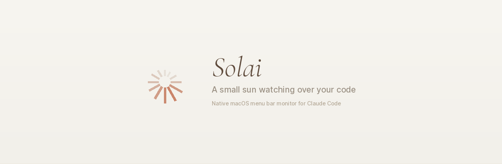

<p align="center">
  
</p>

<p align="center">
  <a href="https://github.com/adroual/solai/releases/latest"></a>
  
  
  <a href="LICENSE"></a>
</p>

<p align="center">
  <b>Native macOS menu bar app that monitors your Claude Code sessions</b><br>
  <sub>Know when Claude is working, done, or waiting for you — without leaving your current app.</sub>
</p>

---

## The Problem

You're deep in a design file, a doc, or another terminal tab. Claude Code is running in the background. You have no idea if it's still working, finished, or waiting for your approval — until you switch back and check. Every time.

## The Solution

Solai lives in your menu bar as a tiny animated icon — **12 radiating bars** that pulse, spin, and breathe to reflect exactly what Claude Code is doing right now. Each state has a distinct motion pattern you can recognize at a glance, even from peripheral vision.

No setup. No accounts. No cloud. Just install and forget.

---

## States

<table>
<tr>
<td width="25%" align="center">
<br>
<b>Sleeping</b><br>
<sub>No active session</sub><br><br>
<sub>Slow, gentle breathing pulse.<br>Bars stay short and dim.</sub>
<br><br>
</td>
<td width="25%" align="center">
<br>
<b>Working</b><br>
<sub>Claude is processing</sub><br><br>
<sub>Rotating energy wave sweeps around.<br>Bars near peak extend long.</sub>
<br><br>
</td>
<td width="25%" align="center">
<br>
<b>Idle</b><br>
<sub>Task complete</sub><br><br>
<sub>All bars uniform length.<br>Calm, synchronized pulse.</sub>
<br><br>
</td>
<td width="25%" align="center">
<br>
<b>Waiting</b><br>
<sub>Needs your input</sub><br><br>
<sub>Alternating ripple bursts.<br>Even/odd bars pulse on offset.</sub>
<br><br>
</td>
</tr>
</table>

> The icon is a **monochromatic template image** — macOS automatically renders it in the correct color for light and dark menu bars. Zero configuration.

---

## Features

**Ambient awareness** — Each animation pattern is instantly distinguishable at a glance. You never need to read text or click anything.

**Multi-session** — Running Claude Code in three projects? Solai tracks them all. The icon shows the highest-priority state (waiting > working > idle > sleeping). The dropdown lists every session with its project name and current state.

**Native notifications** — Get notified when Claude Code finishes a task or needs your input. Notifications include the project name so you know which session needs attention.

**Zero footprint** — Pure Swift, no Electron, no Python, no runtime. Under 5MB binary, under 10MB RAM, under 0.2% CPU while animating.

**Hook-driven** — Uses Claude Code's native hook system. No polling, no CPU waste. State changes propagate in under 100ms via FSEvents.

---

## Install

### Download

Grab the latest `.dmg` from the [**Releases page**](https://github.com/adroual/solai/releases/latest)

Open the `.dmg`, drag Solai to Applications, launch it. On first run, Solai will:

1. Ask for notification permission
2. Install inline hook commands into `~/.claude/settings.json`
3. Optionally set itself to launch at login via Settings

That's it. No accounts, no config files, no terminal commands.

### Build from source

```bash
git clone https://github.com/adroual/solai.git
cd solai
swift build -c release
.build/release/Solai
```

Requires Xcode 15+ and macOS 14 (Sonoma).

---

## How It Works

```
Claude Code event → Inline hook command → State file (/tmp) → FSEvents → Solai → Animated icon
```

Solai registers lightweight inline bash commands into Claude Code's `~/.claude/settings.json` hook configuration. Every time Claude Code changes state (starts working, needs permission, finishes), the hook writes the new state to a file in `/tmp`. Solai watches `/tmp` via macOS FSEvents (not polling) and updates the menu bar animation accordingly.

Each session gets its own state file keyed by PID (`/tmp/solai_state_{PID}`), enabling multi-session tracking. A companion meta file (`/tmp/solai_meta_{PID}`) stores the project path for display in the menu.

---

## Menu Bar Dropdown

```
┌───────────────────────────────┐
│  Sessions                     │
│  crewify — Working            │
│  pmm-kit — Idle               │
│  dentanorme — Waiting         │
│───────────────────────────────│
│  Settings...              ⌘,  │
│  About Solai                  │
│───────────────────────────────│
│  Quit Solai               ⌘Q  │
└───────────────────────────────┘
```

Clicking a session activates your terminal. Hold **Option** to reveal "Uninstall Hooks..." for clean removal.

---

## Technical Details

| | |
|---|---|
| **Language** | Swift 5.9+ |
| **Frameworks** | AppKit, SwiftUI, UserNotifications |
| **Icon rendering** | Core Graphics → NSImage template (22pt) |
| **File watching** | DispatchSource (FSEvents) on `/tmp` |
| **Animation** | 12 bars × 20–30 fps (adaptive) |
| **Min OS** | macOS 14 Sonoma |
| **Binary size** | < 5 MB |
| **Memory** | < 10 MB RSS |
| **CPU** | < 0.2% animating, ~0% sleeping |

---

## Design Philosophy

Solai's icon has no center element — just 12 radiating bars. This was a deliberate choice. Menu bar icons should be **ambient**, not attention-grabbing. The bars communicate state through motion alone:

- **Speed** tells you intensity (slow = calm, fast = active)
- **Uniformity** tells you stability (all equal = settled, uneven = dynamic)
- **Pattern** tells you what to do (rotating = wait, pulsing = look now)

The result: you develop an intuitive sense for what Claude Code is doing without consciously looking at the icon.

---

## License

[MIT](LICENSE) — use it, fork it, improve it.

---

<p align="center">
  <b>☀️ Add a Ray</b><br>
  <sub>Solai is free and open source. If it saves you even one context switch,<br>consider adding a ray to keep the sun shining.</sub><br><br>
  <a href="https://pay.qonto.com/payment-links/019cc8a3-20d5-7905-9ad1-2b221eebdb33?resource_id=019cc8a3-20d6-784c-95de-649c4339549d">
    
  </a>
</p>

---

<p align="center">
  <sub>Built with Claude Code. Monitored by Solai.</sub><br>
  <sub>Made by <a href="https://github.com/adroual">Alex Droual</a></sub>
</p>
